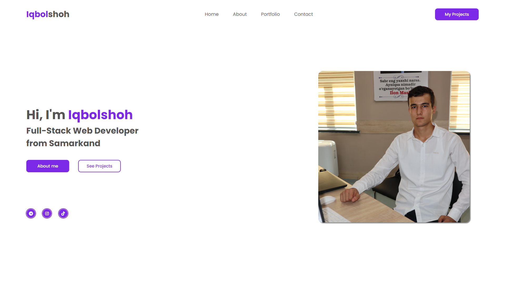
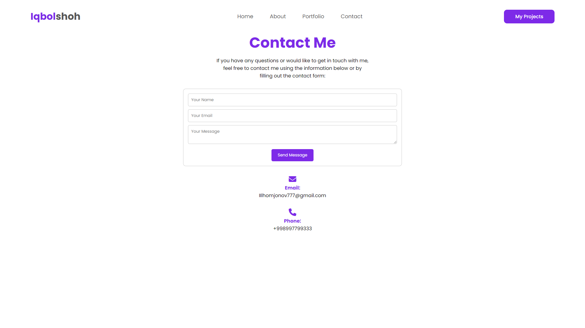
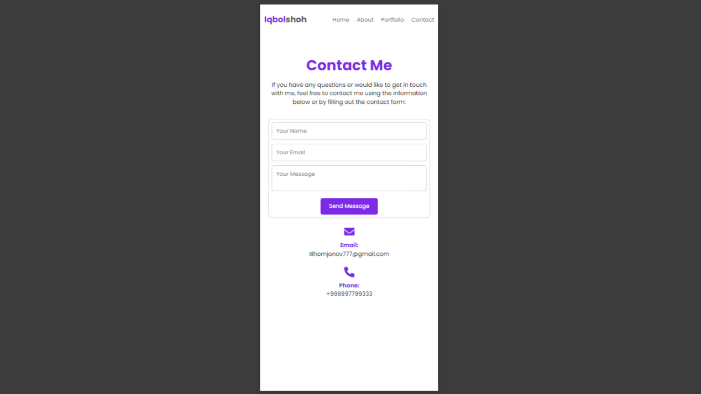

# Ilhomjonov Iqbolshoh's - Personal Website


Welcome to my personal website repository. This website showcases my work as a Full-Stack Web Developer from Samarkand. Below, you'll find information on how to navigate and contribute to the project.

## Table of Contents

- [Overview](#overview)
- [Technologies Used](#technologies-used)
- [Installation](#installation)
- [Usage](#usage)
- [Pages](#pages)
- [Contributing](#contributing)
- [Contact](#contact)

## Overview

This is the source code for my personal website, which includes sections such as "About", "Portfolio", and "Contact". It’s designed to be a simple and clean representation of my skills, projects, and how to reach me.

### Desktop View

<p align="center">
    
    
</p>
<p align="center">
    
    
</p>

### Mobile View

<p align="center">
    
    
</p>
<p align="center">
    
    
</p>

## Technologies Used

<div style="display: flex; flex-wrap: wrap; gap: 5px;">
    
    
    
   
</div>

## Installation

To get a local copy up and running, follow these simple steps:

1. Clone the repository:

   ```bash
   git clone https://github.com/Iqbolshoh/template-personal-website.git
   ```

2. Navigate to the project directory:

   ```bash
   cd template-personal-website
   ```

3. Open `index.html` in your web browser to view the website.

## Usage

- **Home:** This is the landing page where I introduce myself.
- **About:** Learn more about my background, skills, and experience.
- **Portfolio:** Explore the projects I’ve worked on, with links to live demos.
- **Contact:** Get in touch with me through a form or directly via email/phone.

## Pages

- **index.html:** The homepage of the website.
- **about.html:** A detailed description of my professional journey.
- **portfolio.html:** A showcase of my projects.
- **contact.html:** A page to contact me with a form that uses EmailJS for message sending.

## Contributing

Contributions are welcome! If you have suggestions or want to enhance the project, feel free to fork the repository and submit a pull request.


## Connect with Me

I love connecting with new people and exploring new opportunities. Feel free to reach out to me through any of the platforms below:

<table>
    <tr>
        <td>
            <a href="https://github.com/iqbolshoh">
                
            </a>
        </td>
        <td>
            <a href="https://t.me/iqbolshoh_777">
                
            </a>
        </td>
        <td>
            <a href="https://www.linkedin.com/in/iiqbolshoh/">
                
            </a>
        </td>
        <td>
            <a href="https://instagram.com/iqbolshoh_777" target="blank"></a>
        </td>
        <td>
            <a href="https://wa.me/qr/22PVFQSMQQX4F1">
                
            </a>
        </td>
        <td>
            <a href="https://x.com/iqbolshoh_777">
                
            </a>
        </td>
        <td>
            <a href="mailto:iilhomjonov777@gmail.com">
                
            </a>
        </td>
    </tr>
</table>


