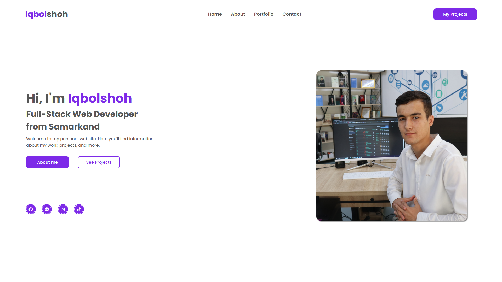
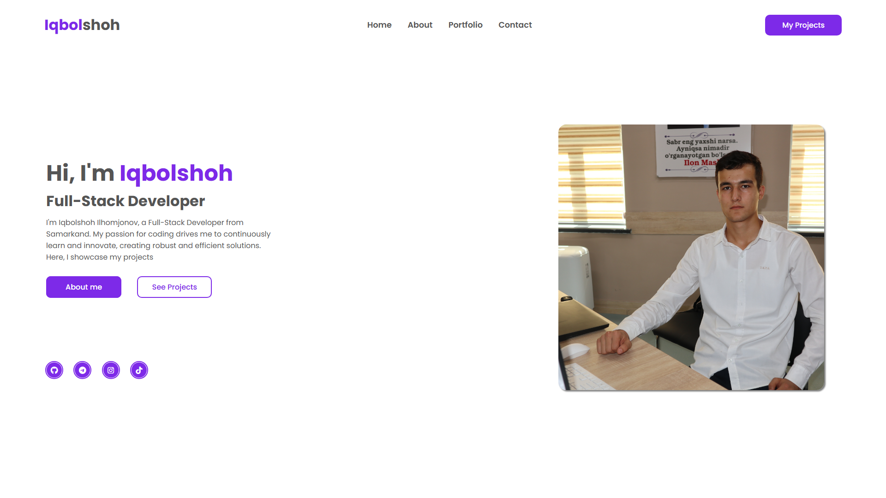
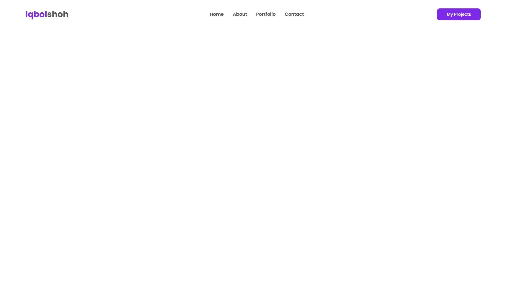
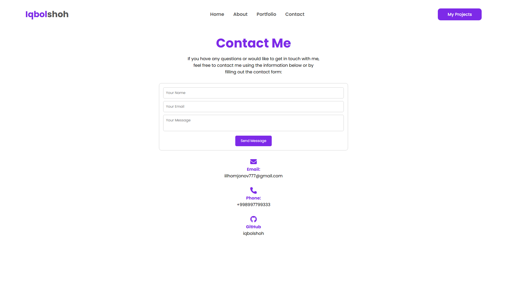

# 🌐 Iqbolshoh Ilhomjonov — Personal Portfolio Website

**Personal Portfolio Website** is a clean, multi-page personal site built with **HTML, CSS, and JavaScript**. It introduces **Iqbolshoh Ilhomjonov**, a Full-Stack Web Developer from Samarkand, and showcases his projects, background, and contact details.

<p align="left">
  
  
  
</p>


## 📚 Table of Contents

- [Overview](#-overview)
- [Screenshots](#️-screenshots)
- [Installation](#️-installation)
- [Project Structure](#-project-structure)
- [Technologies Used](#-technologies-used)
- [License](#-license)
- [Contributing](#-contributing)
- [Connect with Me](#-connect-with-me)

## 📌 Overview

This website includes the following sections:

🔹 **Home** – Introduction and a quick link to social profiles.
🔹 **About** – Background, skills, and experience.
🔹 **Portfolio** – A live-loaded showcase of 13 projects, each linking to its GitHub repo and a one-click source download.
🔹 **Contact** – A contact form (powered by [EmailJS](https://www.emailjs.com/)) plus direct email, phone, and GitHub links.
🔹 **404 Page** – A custom "page not found" screen wired up via `.htaccess`.

## 🖥️ Screenshots

<p align="center">
  
  
</p>
<p align="center">
  
  
</p>

## 🛠️ Installation

### 1️⃣ Clone the repository
```bash
git clone https://github.com/Iqbolshoh/personal-portfolio-website.git
cd personal-portfolio-website
```

### 2️⃣ Open `index.html`
For the Home and About pages, opening `index.html` directly in a browser works fine.

> The **Portfolio** page loads `src/js/projects.json` via `fetch()`, which browsers block on the `file://` protocol. Serve the folder with any local server to view it correctly, e.g.:
> ```bash
> php -S localhost:8000
> ```
> or
> ```bash
> npx http-server
> ```

## 📂 Project Structure

```
personal-portfolio-website/
├── index.html         # Home page
├── about.html          # About page
├── portfolio.html      # Portfolio page (fetches projects.json)
├── contact.html        # Contact page (EmailJS form)
├── 404.html            # Custom error page
├── .htaccess            # Rewrite rules + custom error documents
├── src/
│   ├── css/             # Page-specific and shared stylesheets
│   ├── js/
│   │   ├── script.js     # Contact form + portfolio rendering logic
│   │   └── projects.json # Portfolio project data
│   └── images/           # Banner, profile photos, and project thumbnails
├── LICENSE
└── README.md
```

## 🖥 Technologies Used


## 📜 License
This project is open-source and available under the [MIT License](./LICENSE).

## 🤝 Contributing
🎯 Contributions are welcome! If you have suggestions or want to enhance the project, feel free to fork the repository and submit a pull request.

## 📬 Connect with Me
💬 I love meeting new people and discussing tech, business, and creative ideas. Let's connect! You can reach me on these platforms:

<div align="center">

[](https://iqbolshoh.uz)
[](mailto:iilhomjonov777@gmail.com)
[](https://github.com/iqbolshoh)
[](https://t.me/iqbolshoh_777)
[](https://www.instagram.com/iqbolshoh_777/)
[](https://tiktok.com/@iqbolshoh_777/)

</div>
